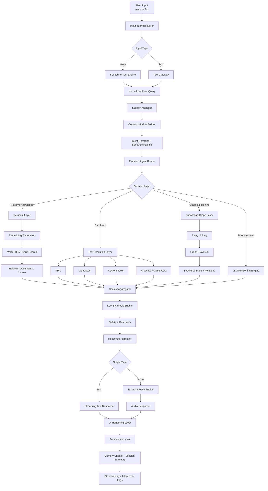

# 🧠 LingoAI — Advanced Conversational AI Platform

LingoAI is a modern **Conversational AI platform** built for intelligent dialogue, reasoning, memory, retrieval, tool execution, and multimodal interaction through **text + voice**.

It is designed as a production-grade foundation for building:

- Conversational copilots
- Voice AI assistants
- Agentic AI systems
- Enterprise knowledge assistants
- Research assistants
- Domain-specific assistants such as healthcare, finance, and legal AI

LingoAI combines **LLMs, retrieval systems, knowledge graphs, planner agents, tool execution, memory layers, safety guardrails, and streaming interfaces** into one unified architecture.

---

# 🚀 Core Capabilities

## 💬 Conversational Intelligence
- Multi-turn contextual conversations
- Intent understanding and semantic parsing
- Dialogue state tracking
- Personalized memory injection

## 🧠 Reasoning and Planning
- LLM-driven reasoning
- Planner-based tool selection
- Multi-step execution
- Hybrid deterministic + generative workflows

## 📚 Retrieval and Knowledge
- Retrieval-Augmented Generation (RAG)
- Hybrid search (vector + keyword)
- Document grounding
- Knowledge graph integration

## 🔧 Tool Calling
- External API calls
- Database querying
- Calculators and analytics tools
- Domain-specific tools

## 🎤 Voice AI
- Speech-to-Text (STT)
- Text-to-Speech (TTS)
- Audio input/output workflows
- Real-time voice interactions

## ⚡ Streaming UX
- Token streaming
- Progressive rendering
- Fast perceived latency
- Interactive AI response flow

## ☁️ Cloud-Native Deployment
- Microservice-ready backend
- Containerized deployment
- Scalable cloud architecture
- Event-driven pipelines

---

# 🏗️ End-to-End Architectural Workflow

System Architecture Layers

1. Input Interface Layer

Handles all user-facing interaction channels.

Supported Channels
	•	Web chat interface
	•	Mobile chat interface
	•	Voice assistant input
	•	API-based messaging
	•	Internal service-to-service requests

Responsibilities
	•	Accept user text or voice input
	•	Generate session metadata
	•	Start streaming lifecycle
	•	Normalize request payloads

⸻

2. Speech Processing Layer

This layer supports voice-driven conversational AI.

Speech-to-Text

Transforms spoken audio into text.

Text-to-Speech

Converts the generated response back into speech.

Example Providers
	•	Whisper
	•	Deepgram
	•	Google Speech API
	•	Amazon Polly
	•	ElevenLabs
	•	Coqui TTS

⸻

3. Session and Context Layer

Maintains the active state of conversation.

Responsibilities
	•	Session tracking
	•	Turn management
	•	Context window building
	•	Conversation summary injection
	•	Short-term memory loading

Context Includes
	•	Recent conversation turns
	•	System prompt
	•	User profile / preferences
	•	Retrieved knowledge snippets
	•	Prior tool outputs

⸻

4. Intent Detection and Semantic Parsing

Extracts actionable meaning from the user’s message.

Functions
	•	Intent detection
	•	Slot extraction
	•	Entity recognition
	•	Semantic decomposition
	•	Domain classification

Example

User:
What medications interact with ibuprofen?

Parsed result:
	•	intent: drug_interaction_check
	•	entity: ibuprofen
	•	domain: medication safety

⸻

5. Planner / Agent Router

This is the central decision-making component.

Responsibilities
	•	Determine response strategy
	•	Choose whether to:
	•	answer directly
	•	retrieve knowledge
	•	call tools
	•	query knowledge graphs
	•	combine multiple paths
	•	Control reasoning steps
	•	Bound execution cost and latency

Typical Planning Outputs
	•	selected lane
	•	selected tools
	•	confidence
	•	max steps
	•	rationale
	•	safety level

⸻

6. Retrieval Layer (RAG)

Used when the answer requires external knowledge grounding.

Responsibilities
	•	Generate embeddings
	•	Search vector databases
	•	Run hybrid search
	•	Return relevant document context
	•	Support evidence-based answer generation

Retrieval Modes
	•	Dense semantic retrieval
	•	Keyword retrieval
	•	Hybrid retrieval
	•	Metadata filtering
	•	Reranking

Example Backends
	•	ChromaDB
	•	Pinecone
	•	Weaviate
	•	FAISS
	•	Elasticsearch

⸻

7. Knowledge Graph Layer

Supports structured reasoning over entities and relationships.

Responsibilities
	•	Entity linking
	•	Concept mapping
	•	Graph traversal
	•	Multi-hop reasoning
	•	Fact validation
	•	Explainability support

Example Use Cases
	•	Drug → interacts_with → Drug
	•	Disease → symptom → Symptom
	•	Product → belongs_to → Category
	•	User → prefers → Setting

Example Graph Databases
	•	Neo4j
	•	Amazon Neptune
	•	ArangoDB

⸻

8. Tool Execution Layer

Tools extend the system beyond pure language generation.

Tool Categories
	•	APIs
	•	SQL / NoSQL queries
	•	Calculators
	•	Search tools
	•	Internal microservices
	•	ML prediction services
	•	Domain engines

Example

User:
Calculate BMI for 85 kg and 170 cm

Planner:
	•	detect calculation intent
	•	call BMI tool
	•	return result with explanation

⸻

9. LLM Reasoning Engine

The LLM is responsible for understanding, reasoning, planning support, and response synthesis.

Responsibilities
	•	Interpret the user request
	•	Reason over retrieved/tool-provided context
	•	Generate final response
	•	Preserve conversational tone
	•	Support multi-turn continuity

Supported Models
	•	OpenAI GPT models
	•	Claude
	•	Groq-hosted LLaMA
	•	Local models via Ollama / LM Studio

⸻

10. Context Aggregation and Response Synthesis

This layer combines outputs from all previous subsystems before final generation.

Inputs Can Include
	•	Recent conversation
	•	Session memory
	•	Retrieved documents
	•	Tool outputs
	•	Knowledge graph facts
	•	Safety constraints

Output

A grounded and coherent response prompt for the final LLM synthesis pass.

⸻

11. Safety and Guardrails Layer

Ensures the system behaves safely and predictably.

Responsibilities
	•	Prompt injection defense
	•	Tool access policy enforcement
	•	Unsafe content filtering
	•	Output validation
	•	Sensitive-domain controls
	•	Refusal / abstention logic where required

Important For
	•	Healthcare AI
	•	Finance AI
	•	Legal AI
	•	Enterprise internal assistants

⸻

12. Output Rendering Layer

Formats and streams the final output to the user.

Output Modes
	•	Streaming text response
	•	Voice response
	•	Structured cards
	•	Tool timeline/status events
	•	Citations / references

UX Features
	•	Progressive answer streaming
	•	Fast-first-token experience
	•	Tool progress indicators
	•	Assistant message persistence

⸻

13. Persistence and Memory Layer

Stores conversation history and user-specific knowledge.

Short-Term Memory
	•	Current chat history
	•	Current task state
	•	Active tool outputs

Long-Term Memory
	•	User profile
	•	Preferences
	•	Historical facts
	•	Conversation summaries

Storage Options
	•	MongoDB
	•	PostgreSQL
	•	Redis
	•	Vector memory store

⸻

14. Observability and Telemetry Layer

Tracks reliability, quality, and performance.

Metrics
	•	Latency
	•	Tool success/failure
	•	Planner decisions
	•	Retrieval hit rate
	•	Hallucination incidents
	•	Streaming completion integrity
	•	User feedback signals

Use Cases
	•	Debugging
	•	Benchmarking
	•	Model evaluation
	•	Production monitoring

⸻

Conversational Request Lifecycle

sequenceDiagram
    participant U as User
    participant UI as Frontend UI
    participant API as FastAPI Backend
    participant CTX as Context Manager
    participant PLN as Planner
    participant RET as Retrieval Layer
    participant KG as Knowledge Graph
    participant TOOL as Tool Engine
    participant LLM as LLM Engine
    participant SAFE as Safety Layer
    participant DB as Persistence Layer

    U->>UI: Send text or voice query
    UI->>API: POST /chat
    API->>CTX: Build session context
    CTX-->>API: Recent history + memory summary
    API->>PLN: Analyze intent and decide route

    alt Retrieve knowledge
        PLN->>RET: Search relevant documents
        RET-->>PLN: Retrieved context
    end

    alt Query knowledge graph
        PLN->>KG: Resolve entities and relations
        KG-->>PLN: Structured graph facts
    end

    alt Call tools
        PLN->>TOOL: Execute selected tools
        TOOL-->>PLN: Tool outputs
    end

    PLN->>LLM: Send final grounded context
    LLM-->>SAFE: Draft response
    SAFE-->>API: Validated / filtered response
    API->>UI: Stream final response
    API->>DB: Save turn, summary, metadata
    UI-->>U: Render answer

Core Design Patterns

1. Direct Response Pattern

Used when the answer can be generated from model knowledge and conversation context.

2. Retrieval-Augmented Pattern

Used when the answer requires external documents or proprietary knowledge.

3. Tool-Calling Pattern

Used when the request requires actions, calculations, or external systems.

4. Graph-Reasoning Pattern

Used when explicit structured relationships improve reasoning or explainability.

5. Hybrid Agentic Pattern

Used when the answer needs a mix of retrieval, tools, graph reasoning, and synthesis.

⸻

 Retrieval-Augmented Generation Workflow

 flowchart LR
 
    A[User Query] --> B[Embedding Model]
    B --> C[Vector Search]
    C --> D[Candidate Chunks]
    D --> E[Reranker / Filter]
    E --> F[Top Context]
    F --> G[LLM Prompt Assembly]
    G --> H[Generated Grounded Answer]

   Knowledge Graph Reasoning Workflow

     flowchart LR
    A[User Query] --> B[Entity Extraction]
    B --> C[Entity Linking]
    C --> D[Graph Query]
    D --> E[Traverse Relevant Relations]
    E --> F[Collect Structured Facts]
    F --> G[LLM Explanation Layer]
    G --> H[Explainable Answer]

  Tool Execution Workflow
  
  flowchart LR
  
    A[User Query] --> B[Planner]
    B --> C{Need Tool?}
    C -->|Yes| D[Select Tool]
    D --> E[Execute Tool]
    E --> F[Receive Structured Output]
    F --> G[LLM Synthesis]
    C -->|No| G
    G --> H[Final Response]

Voice Workflow

flowchart LR

    A[User Speech] --> B[Speech-to-Text]
    B --> C[Conversational Engine]
    C --> D[LLM / Tools / Retrieval]
    D --> E[Final Text Response]
    E --> F[Text-to-Speech]
    F --> G[Audio Response]

  Technology Stack

Backend
	•	Python
	•	FastAPI
	•	AsyncIO
	•	Uvicorn / Gunicorn

AI / Agent Frameworks
	•	LangChain
	•	LangGraph
	•	Custom orchestration
	•	MCP-compatible tool architecture

LLM Providers
	•	OpenAI
	•	Anthropic Claude
	•	Groq
	•	Ollama
	•	LM Studio

Retrieval
	•	ChromaDB
	•	Pinecone
	•	Weaviate
	•	FAISS
	•	Elasticsearch

Knowledge Graph
	•	Neo4j
	•	Amazon Neptune
	•	ArangoDB

Databases
	•	PostgreSQL
	•	MongoDB
	•	Redis

Voice Stack
	•	Whisper
	•	Deepgram
	•	Google Speech API
	•	ElevenLabs
	•	Amazon Polly
	•	Coqui TTS

Infra / DevOps
	•	Docker
	•	Kubernetes
	•	Nginx
	•	GitHub Actions
	•	AWS EC2
	•	AWS Lambda
	•	AWS S3
	•	CloudFront

    
     
    
